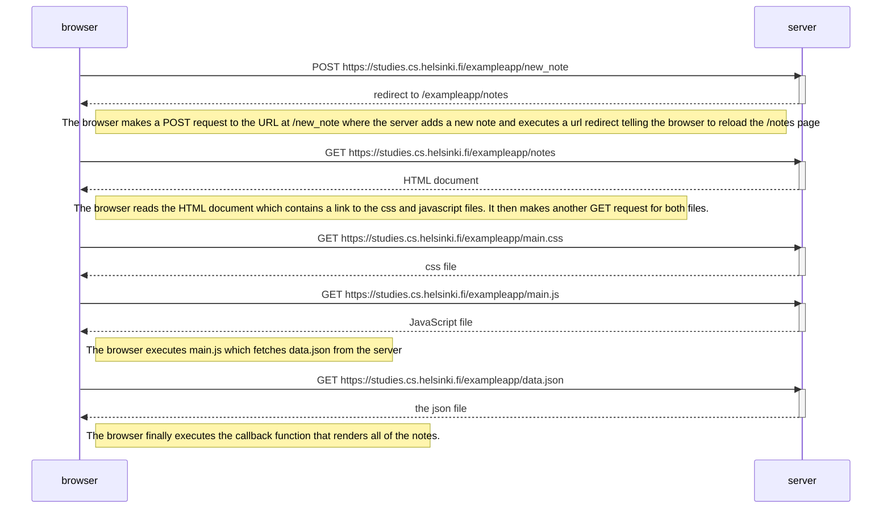

A Sequence diagram that displays what happens when a user adds a new note:

```mermaid
  sequenceDiagram
      participant browser
      participant server

      browser->>server: POST https://studies.cs.helsinki.fi/exampleapp/new_note
      activate server
      server-->>browser: redirect to /exampleapp/notes
      deactivate server

      Note right of browser: The browser makes a POST request to the URL at /new_note where the server adds a new note and executes a url redirect telling the browser to reload the /notes page

      browser->>server: GET https://studies.cs.helsinki.fi/exampleapp/notes
      activate server
      server-->>browser: HTML document
      deactivate server

      Note right of browser: The browser reads the HTML document which contains a link to the css and javascript files. It then makes another GET request for both files.

      browser->>server: GET https://studies.cs.helsinki.fi/exampleapp/main.css
      activate server
      server-->>browser: css file
      deactivate server

      browser->>server: GET https://studies.cs.helsinki.fi/exampleapp/main.js
      activate server
      server-->>browser: JavaScript file
      deactivate server

      Note right of browser: The browser executes main.js which fetches data.json from the server

      browser->>server: GET https://studies.cs.helsinki.fi/exampleapp/data.json
      activate server
      server-->>browser: the json file
      deactivate server

      Note right of browser: The browser finally executes the callback function that renders all of the notes.
```
