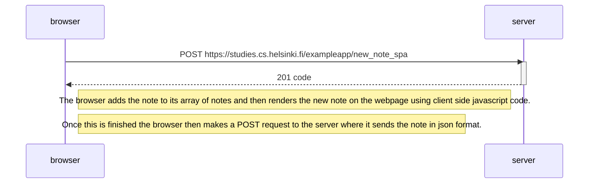

The following sequence diagram shows what occurs when a user enters a new note into the SPA. 
In contrast to the traditional web application in exercise 0.4, the application does not reload entirely and instead simply makes one POST request to the server.

